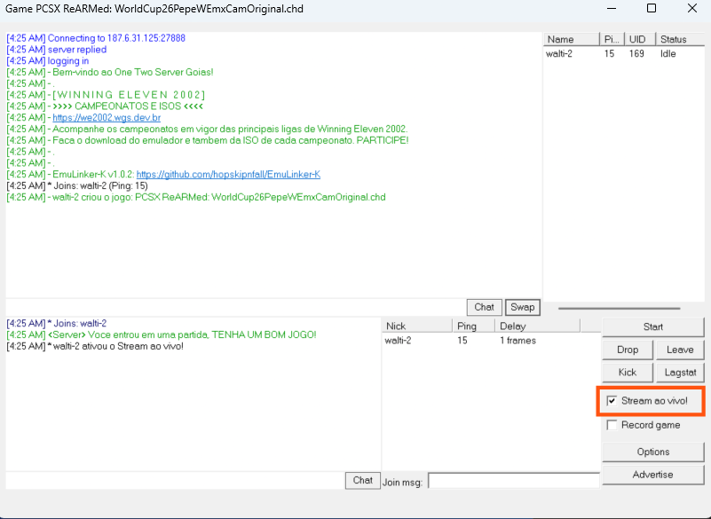
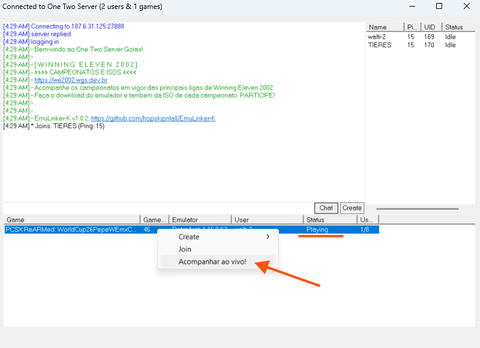

# N02 — Kaillera Client

[](https://github.com/TIERES/kaillera-client/actions/workflows/build.yml)

🇧🇷 [Leia em Português](README.pt-BR.md)

N02 is a `kailleraclient.dll` implementation that adds netplay to N64 emulators (originally built for the **RMG** emulator, but compatible with any frontend that loads a standard Kaillera client DLL). It supports three netplay modes:

- **P2P** — direct peer-to-peer connections, no server required.
- **Server (Kaillera)** — classic Kaillera server netplay, compatible with `kaillera.com`-style servers and the public server list.
- **Playback** — replays recorded `.krec` matches, and now also **live spectating** (see below).

## ✨ New: Live Streaming ("Stream ao vivo!")

Anyone in a Kaillera room can now watch a match **while it's still being played**, without joining the game and without needing to run the same emulator as the host.

### For the host: enable "Stream ao vivo!"

While hosting a room, check **"Stream ao vivo!"** next to "Record game". This pushes a live copy of the match (the same input-frame data written to your local `.krec` recording) to a community spectate server in the background.



Everyone else in the room also sees the checkbox — disabled, since only the host can toggle it — and gets a chat notice whenever the host turns it on or off, so nobody needs to guess whether a live stream is currently available. Anyone who joins the room after streaming was already turned on is caught up automatically.

### For spectators: "Acompanhar ao vivo!"

In the server lobby, any room whose status is **Playing** gets an extra option in its right-click menu: **"Acompanhar ao vivo!"** ("Watch live!"). It only shows up if the room is actually playing — no need to check the game list.



Clicking it looks up the room's live session and switches your client straight into Playback mode to replay the match as it happens, a few seconds behind the live action. You don't need to be a player in that match, and your emulator doesn't need to match the host's build — you're just watching the recorded input stream play out.

If the host hasn't enabled streaming yet (or the stream hasn't started sending data), you'll get a short message explaining that instead of the match starting.

## Other modes

- **P2P mode** connects two players directly over UDP — see `core/p2p_core.cpp`.
- **Server mode** talks to a Kaillera-protocol server for lobby/room management — see `kcore/kaillera_core.cpp`.
- **Playback mode** replays local `.krec` recordings, or a live stream as described above — see `player.cpp`.

Recordings use the `.krec` format: a `KRC1` header (app name, game name, timestamp, player number, player count, and per-player names) followed by a stream of typed records (input frames, chat, player drops).

## Getting the DLL

Grab a prebuilt `kailleraclient.dll` from the [Releases](https://github.com/TIERES/kaillera-client/releases) page — pick **x64** or **x86** to match your emulator's architecture (most modern emulators, including RMG, are x64).

To use it, copy the downloaded `kailleraclient.dll` into your emulator's folder, replacing any existing one.

## Building from source

Requirements: Windows, Visual Studio 2019+ with the C++ workload (Windows SDK 10.0).

```bat
:: 64-bit (most emulators)
build.bat

:: 32-bit
build-x86.bat
```

The scripts auto-detect your installed MSBuild (VS2019/2022/2026) and build `kailleraclient.dll` into `x64\Release\` (64-bit) or `Release\` (32-bit). CI builds and publishes both architectures automatically on every `v*` tag.

## Credits

- Kaillera protocol and API: (c) 2001-2002 Christophe Thibault.
- N02 / N02.P2P: (c) Open Kaillera.
